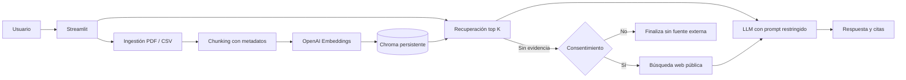

# Archivo Vivo: asistente RAG para PDF y CSV

Aplicación web que responde preguntas con evidencia extraída de documentos PDF y CSV. Cada
respuesta documental incluye el archivo y la página o fila utilizada. Si la información no existe
en el corpus, la aplicación solicita permiso antes de consultar fuentes públicas en la web.

## Inicio rápido

Requisitos: Python 3.10 a 3.12 y una clave de OpenAI.

```powershell
python -m venv .venv
.\.venv\Scripts\Activate.ps1
python -m pip install -e ".[dev]"
Copy-Item .env.example .env
```

Agrega `OPENAI_API_KEY` en `.env` y ejecuta:

```powershell
streamlit run app.py
```

Abre `http://localhost:8501`. Los cinco PDF de `docs/` se indexan automáticamente en el
primer inicio. La primera indexación consume la API de embeddings; los siguientes reinicios
reutilizan Chroma y no vuelven a procesar archivos sin cambios.

## Qué puede hacer

| Capacidad | Comportamiento |
|---|---|
| Corpus inicial | Indexa los cinco PDF incluidos en `docs/` |
| Nuevos documentos | Acepta múltiples archivos PDF y CSV desde la barra lateral |
| Trazabilidad PDF | Conserva nombre de archivo y número de página |
| Trazabilidad CSV | Conserva nombre de archivo y fila; la primera fila de datos es la fila 2 |
| Respuestas | Usa únicamente los fragmentos recuperados y exige citas `[S1]`, `[S2]` |
| Sin evidencia | Informa que no encontró la respuesta y solicita autorización |
| Fuente externa | Consulta la web solo después de pulsar **Buscar en la web** y muestra enlaces |
| Persistencia | Guarda documentos, manifiesto e índice vectorial en `data/` |

Los PDF escaneados sin texto seleccionable no se procesan. Deben pasar por OCR antes de ser
cargados.

## Arquitectura



### Flujo documental

1. `DocumentLoader` extrae una unidad por página del PDF o por fila del CSV.
2. `RecursiveCharacterTextSplitter` divide unidades extensas sin perder sus metadatos.
3. `KnowledgeBase` genera identificadores deterministas y registra cada archivo en
   `data/manifest.json`.
4. Chroma recupera hasta `RAG_TOP_K` fragmentos y descarta resultados por debajo de
   `RAG_MIN_RELEVANCE`.
5. El modelo recibe únicamente esos fragmentos, debe citar sus etiquetas y puede devolver
   `NO_ENCONTRADO`.
6. La aplicación valida las etiquetas citadas. Una respuesta sin citas válidas se rechaza como
   no fundamentada.

### Persistencia e idempotencia

```text
data/
  uploads/       Archivos cargados desde la interfaz
  chroma/        Índice vectorial persistente
  manifest.json  Hash e identificadores de chunks por archivo
```

Un archivo sin cambios no se vuelve a indexar. Si cambia su contenido conservando el mismo
nombre, los nuevos fragmentos se agregan y los identificadores anteriores se eliminan.

## Ejemplos de preguntas

Los documentos incluidos permiten responder, entre otras, estas preguntas:

| Pregunta | Respuesta esperada resumida |
|---|---|
| ¿Qué tecnologías se utilizan en el back-end? | Java 17+, Spring Boot 3+, Spring Security y Spring Data JPA |
| ¿Cuántas aprobaciones necesita un Pull Request? | Al menos dos aprobaciones de perfiles Senior o Pleno |
| ¿Cuál es la cobertura mínima de pruebas unitarias? | 80% |
| ¿Qué base vectorial usa el servicio de IA? | Pinecone |
| ¿Cuál es el SLA de respuesta de un incidente SEV-1? | 15 minutos |
| ¿Qué ocurre cuando se agota el Error Budget? | Se pausan los despliegues de nuevas funcionalidades |

La interfaz muestra las citas exactas. Los textos anteriores son ejemplos y no sustituyen la
respuesta generada a partir de los fragmentos recuperados.

## Configuración

Copia `.env.example` a `.env` y ajusta estas variables:

| Variable | Obligatoria | Valor predeterminado | Uso |
|---|---:|---|---|
| `OPENAI_API_KEY` | Sí | Sin valor | Embeddings y respuestas |
| `OPENAI_CHAT_MODEL` | No | `gpt-4o-mini` | Modelo generativo |
| `OPENAI_EMBEDDING_MODEL` | No | `text-embedding-3-small` | Modelo de embeddings |
| `RAG_CHUNK_SIZE` | No | `1200` | Tamaño del fragmento en caracteres |
| `RAG_CHUNK_OVERLAP` | No | `200` | Superposición entre fragmentos |
| `RAG_TOP_K` | No | `4` | Máximo de fragmentos recuperados |
| `RAG_MIN_RELEVANCE` | No | `0.2` | Umbral de relevancia entre 0 y 1 |
| `MAX_UPLOAD_MB` | No | `20` | Límite por archivo |
| `WEB_SEARCH_RESULTS` | No | `5` | Máximo de resultados web |
| `DATA_DIR` | No | `./data` | Ruta de persistencia |

No publiques `.env`. El archivo está excluido por `.gitignore` y la imagen Docker no lo copia.

## Calidad

```powershell
python -m ruff check app.py src tests
python -m pytest
python -m compileall -q app.py src
```

La suite cubre extracción de metadatos, validación de cargas, reemplazo idempotente,
filtrado por relevancia, rechazo de respuestas sin citas, historial conversacional y separación
de fuentes web.

## Docker

```powershell
docker build -t rag-alura .
docker run --rm -p 8501:8501 --env-file .env -v rag-data:/app/data rag-alura
```

El volumen `rag-data` evita perder archivos cargados y embeddings al reemplazar el contenedor.

## Despliegue en OCI Compute

La receta incluida utiliza una VM Oracle Linux y Docker Compose. No requiere servicios OCI
administrados adicionales.

### 1. Crear la instancia

1. Crea una instancia **OCI Compute** con Oracle Linux 9, IP pública y una clave SSH.
2. En la Network Security List o Network Security Group habilita la entrada TCP al puerto `8501`.
3. Para una demostración puede usarse `0.0.0.0/0`; para producción restringe el origen y
   coloca un proxy HTTPS delante de Streamlit.

### 2. Preparar el servidor

```bash
ssh opc@<IP_PUBLICA>
git clone <URL_DEL_REPOSITORIO_GITHUB> rag-alura
cd rag-alura
chmod +x deploy/oci/install-docker.sh
./deploy/oci/install-docker.sh
```

Cierra la sesión SSH y vuelve a ingresar para aplicar el grupo `docker`.

Si `firewalld` está activo, habilita también el puerto en el sistema operativo:

```bash
sudo firewall-cmd --permanent --add-port=8501/tcp
sudo firewall-cmd --reload
```

### 3. Configurar y levantar

```bash
cp .env.example .env
nano .env
docker compose -f deploy/oci/compose.yaml up -d --build
docker compose -f deploy/oci/compose.yaml ps
```

La aplicación queda disponible en `http://<IP_PUBLICA>:8501`.

### 4. Verificar

```bash
curl http://127.0.0.1:8501/_stcore/health
docker compose -f deploy/oci/compose.yaml logs --tail=100
```

El health check debe responder `ok`.

## Evidencia de despliegue

Este repositorio incluye la configuración, pero la evidencia debe actualizarse después de crear
la instancia con credenciales OCI reales:

- URL pública: `PENDIENTE_DE_DEPLOY`
- Captura: agregar en `docs/deployment/` y enlazarla aquí
- Fecha de verificación: `PENDIENTE`

No se incluye una URL ficticia: la validación del proyecto exige una instancia accesible y una
captura real.

## Consideraciones de seguridad

- La aplicación no incluye autenticación. Agregala antes de exponer documentos privados.
- Los PDF actuales contienen marcas de uso interno o confidencial. Confirma que tienes permiso
  para publicarlos antes de desplegar una demo abierta.
- Las preguntas, fragmentos recuperados y extractos web se envían al proveedor del modelo.
- La búsqueda web no se ejecuta automáticamente ni se mezcla silenciosamente con las fuentes
  documentales.
- Para producción, termina TLS en un load balancer o proxy, restringe el puerto `8501` y almacena
  `OPENAI_API_KEY` en OCI Vault.

## Estructura del repositorio

```text
.
├── app.py                       Interfaz y flujo de consentimiento
├── src/rag_alura/
│   ├── assistant.py             Respuestas fundamentadas y citas
│   ├── config.py                Configuración por entorno
│   ├── documents.py             Extracción PDF/CSV y cargas seguras
│   ├── knowledge_base.py        Chroma, manifiesto y recuperación
│   └── web_search.py            Búsqueda pública opcional
├── tests/                       Pruebas unitarias
├── docs/                        Corpus PDF inicial
├── deploy/oci/                  Docker Compose e instalación en OCI
├── Dockerfile
└── .github/workflows/ci.yml     Lint, pruebas y compilación
```
